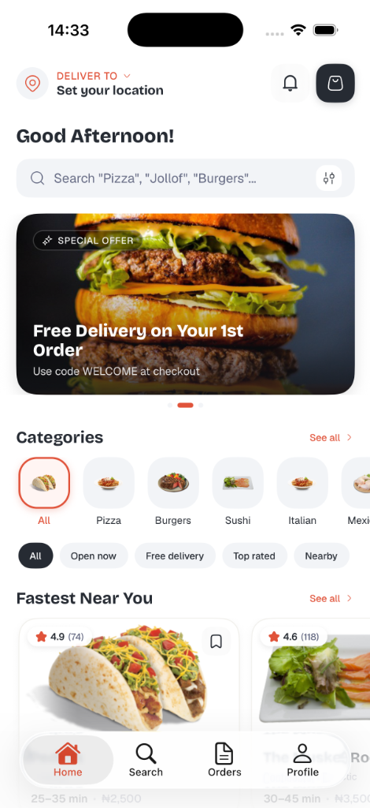
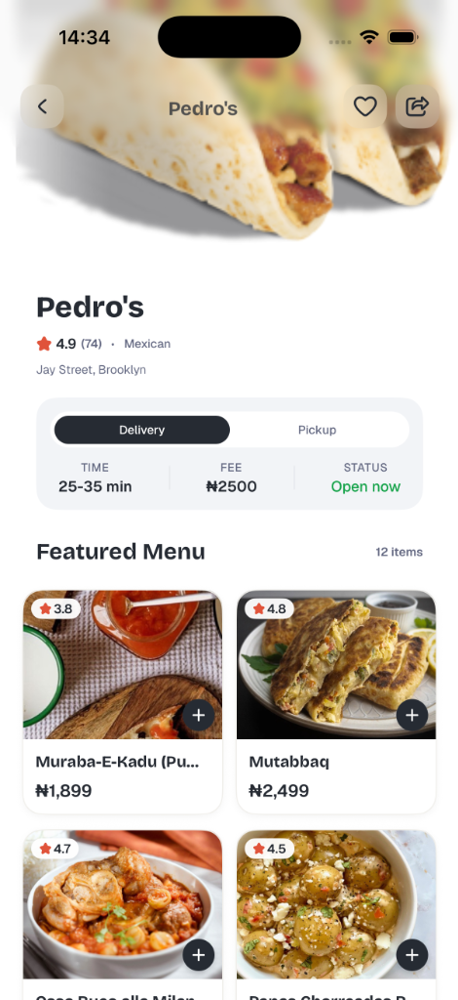
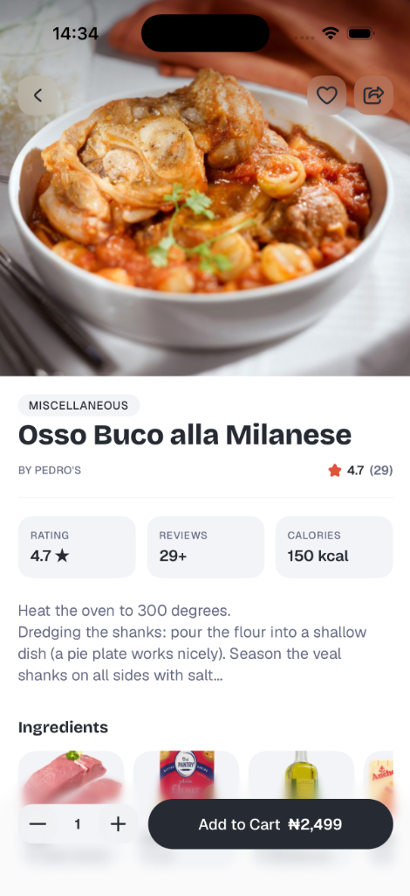
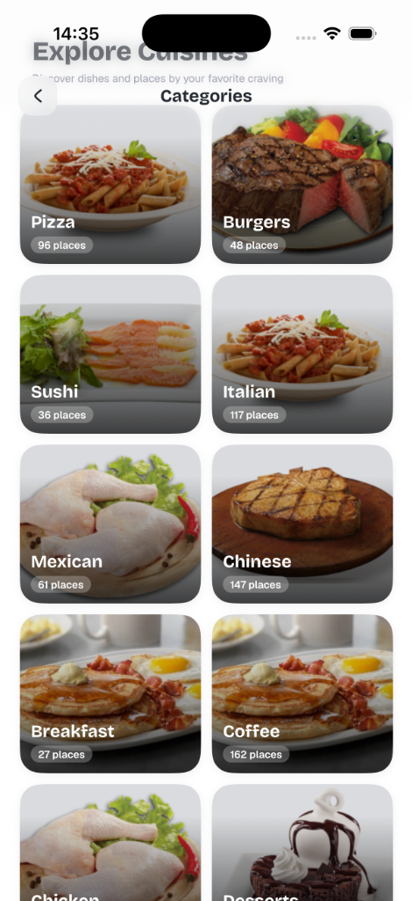

# Dfood — On-Demand Food Delivery & Discovery

A high-performance on-demand food delivery mobile application built with **React Native**, **Expo SDK 57**, **React 19**, **TypeScript**, and **NativeWind (Tailwind CSS)**. Dfood delivers a seamless ordering and discovery experience featuring a custom **Progressive Blur** glass design system, smooth 60fps virtualization with **Shopify FlashList**, interactive location mapping, Paystack payment integration, and local-first offline state with optional **Firebase Cloud Sync**.

---

## 📱 Screenshots

<div align="center">
  <table>
    <tr>
      <td align="center" width="25%">
        
        <br/>
        <strong>Home Feed</strong>
        <br/>
        <sub>Interactive promos & rails</sub>
      </td>
      <td align="center" width="25%">
        
        <br/>
        <strong>Restaurant Details</strong>
        <br/>
        <sub>Hero image & 2-col menu</sub>
      </td>
      <td align="center" width="25%">
        
        <br/>
        <strong>Food Item Details</strong>
        <br/>
        <sub>Metrics & sticky glass CTA</sub>
      </td>
      <td align="center" width="25%">
        
        <br/>
        <strong>Explore Cuisines</strong>
        <br/>
        <sub>2-col grid with scrim</sub>
      </td>
    </tr>
  </table>
</div>

---

## ✨ Key Features

### 🍽️ Food & Restaurant Discovery
- **Dynamic Home Feed**: Time-aware personalized greetings, interactive promotional banner carousel with pagination, category quick-switch rail, and "Fastest Near You" restaurant feed.
- **2-Column Cuisines Grid**: Rich visual categories with count badges, gradient scrims, and instant category-filtered navigation.
- **Detailed Restaurant Profiles**: Full-bleed hero headers with pinned glass navigation, delivery vs. pickup mode toggling, real-time open/closed status indicators, and categorized menu grids.
- **Rich Food Item Details**: Multi-metric stat grid (Ratings, Reviews count, Calorie estimates), recipe preparation details, horizontal ingredient rails with high-resolution imagery, and quantity steppers.
- **Fast Search & Smart Filters**: Instant debounced searching across dishes and restaurants, search history tags, fast toggle pills (*Open now*, *Free delivery*, *Top rated*), and a bottom filter sheet for deep sorting.

### 🛒 Shopping Cart & Single-Screen Checkout
- **Persistent Cart**: Zustand store backed by AsyncStorage with single-restaurant cart protection and multi-item management.
- **Promo Vouchers**: Real-time discount code calculation and validation.
- **Streamlined Checkout**: Single-screen checkout with address picker, delivery notes, and dynamic order summary calculations (Subtotal, Delivery fee, Taxes, Discounts).
- **Payment Processing**: Seamless Paystack card payment flow with demo fallbacks and Cash on Delivery support.

### 📦 Live Order Management & Tracking
- **Order Tracking**: Multi-step live visual progress tracker (*Order Placed* → *Preparing* → *On the Way* → *Delivered*).
- **Order History**: Past orders review with status badges and instant re-order shortcuts.
- **Order Cancellation**: One-tap order cancellation for pending orders.

### 📍 Addresses & Interactive Maps
- **Pinpoint Address Selection**: Interactive MapView with coordinate picking and live GPS location detection via `expo-location`.
- **Automatic Reverse Geocoding**: Converts map coordinates into formatted street, city, and state names.
- **Address Management**: Save multiple custom addresses (*Home*, *Work*, *Other*) with default selection flags.

### 👤 Profile, Preferences & Cloud Sync
- **Local-First Architecture**: 100% functional offline or in Guest Mode.
- **Non-Blocking Auth Sheet**: Beautiful bottom sheet with Apple & Google sign-in options.
- **Firebase Cloud Sync**: Optional bi-directional Firestore cloud sync mirroring profiles, favorites, addresses, and orders across devices.
- **Native System Controls**: Native `@expo/ui` switch controls for notification and deal alert preferences.

---

## 🎨 Design System & Visual Architecture

Dfood follows a calm, photography-driven design system inspired by **DoorDash** and **Instacart**, paired with high-polish glassmorphic touches.

### 🔤 Typography System
A semantic two-family pairing combining **Bricolage Grotesque** (display/titles) with **Geist** (UI, body, and numerics):

| Semantic Role | Font Family & Weight | Class Name | Usage |
| :--- | :--- | :--- | :--- |
| **Display** | Bricolage Grotesque ExtraBold (800) | `font-display` | Screen hero titles, restaurant/dish titles |
| **Title** | Bricolage Grotesque Bold (700) | `font-title` | Section headings, card titles, modal headers |
| **Body** | Geist Regular (400) | `font-body` | Paragraphs, descriptions, form inputs |
| **Label** | Geist Medium (500) | `font-label` | Button labels, filter chips, metadata subtitles |
| **Caption** | Geist Medium (500) | `font-caption` | All-caps tags (`SPECIAL OFFER`, `DELIVERY TO`, `OPEN NOW`) |
| **Numeric** | Geist SemiBold (600) | `font-numeric` | Prices (`₦...`), ratings (`★ 4.8`), delivery times |

### 🎨 Color Palette & Design Tokens
Defined in `tailwind.config.js` and consumed via NativeWind classes:

- **Primary Accent (`#E0533A`)**: Deep coral-red used for rating stars, active favorites, and selected states.
- **Secondary Ink (`#262B33`)**: Deep neutral ink used for typography headings and primary CTA buttons.
- **Surface Muted (`#F2F4F7`)**: Neutral cool-warm gray used for card surfaces, quantity steppers, and pill backgrounds.
- **Text Gray (`#646982`)**: Secondary neutral for metadata, subtitles, and supporting labels.

### 🪟 Progressive Blur & Glassmorphism
- **Multi-Stop Progressive Blur**: Built with `expo-blur` and `@react-native-masked-view/masked-view` to create non-linear alpha masks that smoothly dissolve scrollable content under headers and footers.
- **Pinned Detail Headers**: Pinned glass navigation (`ScreenHeader variant="detail"`) linked to Reanimated scroll drivers (`useProgressiveBlurScroll`).
- **Progressive Blur Footers**: Pinned bottom action bars with blur gradients (`ProgressiveBlurFooter`) over sticky checkouts and add-to-cart buttons.

### ⚡ 60fps Performance Rules
1. **List Virtualization**: 100% `@shopify/flash-list` across all feeds, grids, and horizontal rails.
2. **Optimized Imagery**: Hardware-accelerated `expo-image` with automatic memory caching and priority decoding.
3. **GPU-Only Transitions**: Reanimated worklets strictly operating on `transform` and `opacity` properties.
4. **React Compiler Compatibility**: Reanimated shared values accessed via `.get()` / `.set()` semantics.

---

## 🛠️ Tech Stack

### Core Framework & UI
| Package | Version | Purpose |
| :--- | :--- | :--- |
| **React Native** | 0.86.2 | Mobile runtime |
| **Expo SDK** | 57.0.11 | Application platform |
| **React** | 19.2.3 | Component model & React Compiler |
| **Expo Router** | ~57.0.11 | File-based typed routing |
| **NativeWind** | ^4.2.1 | Tailwind CSS engine for React Native |
| **TypeScript** | ~6.0.3 | Full static type safety |
| **@expo/ui** | ~57.0.10 | Native platform controls (SwiftUI & Jetpack Compose) |
| **Shopify FlashList** | 2.0.2 | High-performance list virtualization |
| **Hugeicons** | ^1.0.15 | Consistent stroke-rounded icon system |

### State Management & Networking
| Package | Version | Purpose |
| :--- | :--- | :--- |
| **Zustand** | ^5.0.11 | Local client state (Cart, Favorites, Addresses, Search) |
| **TanStack React Query** | ^5.90.20 | Asynchronous server caching & mutation lifecycle |
| **AsyncStorage** | 2.2.0 | Offline persistence storage |
| **Firebase** | ^12.17.1 | Optional Firestore cloud sync & authentication |
| **Axios** | ^1.13.5 | REST API client |

### Hardware & Device APIs
| Package | Version | Purpose |
| :--- | :--- | :--- |
| **Expo Blur** | ^57.0.2 | Real-time native glassmorphism |
| **React Native Maps** | 1.27.2 | Interactive native maps |
| **Expo Location** | ~57.0.8 | Device GPS & reverse geocoding |
| **Expo Haptics** | ~57.0.1 | Tactile haptic feedback on gestures |
| **Expo Image** | ~57.0.2 | High-performance cached imagery |

---

## 📂 Project Structure

```
Dfood-app/
├── app/                        # Expo Router file-based routes
│   ├── _layout.tsx             # Root layout with providers & font loading
│   ├── (app)/                  # Authenticated / main application stack
│   │   ├── (tabs)/             # Bottom tab navigator
│   │   │   ├── _layout.tsx     # Custom glass tab bar
│   │   │   ├── index.tsx       # Home feed & discovery
│   │   │   ├── search.tsx      # Search & filter screen
│   │   │   ├── orders.tsx      # Orders list & live status
│   │   │   └── profile.tsx     # User profile & preferences
│   │   ├── categories/         # Categories index & category detail
│   │   ├── restaurants/        # Restaurant list & restaurant detail
│   │   ├── food/[id].tsx       # Food item detail modal screen
│   │   ├── cart.tsx            # Cart screen
│   │   ├── checkout.tsx        # Single-screen checkout
│   │   ├── order-confirmation.tsx # Order success screen
│   │   └── profile/            # Profile sub-screens (Addresses, Cards, Info)
├── components/                 # Reusable UI component library
│   ├── auth/                   # Non-blocking Apple/Google auth sheets
│   ├── home/                   # Home promo carousel, category rails
│   ├── ui/                     # Atoms (Buttons, ScreenHeader, ProgressiveBlur, etc.)
│   └── RestaurantCard.tsx      # Multi-variant restaurant cards
├── hooks/                      # Custom React Query & mutation hooks
├── lib/                        # API clients, adapters, and Firebase configuration
├── store/                      # Zustand state stores (Cart, Profile, Search, etc.)
├── types/                      # TypeScript domain models and API contracts
├── docs/                       # Design system documentation & redesign prompt logs
├── screenshots/                # Application preview screenshots
└── scripts/                    # Native build automation scripts
```

---

## 🚀 Getting Started

### Prerequisites
- **Node.js**: v20.x or higher
- **npm** or **yarn**
- **iOS Simulator** (macOS + Xcode) or **Android Emulator** (Android Studio)
- **Expo Go** app on physical device (optional)

### 1. Installation
Clone the repository and install dependencies:
```bash
git clone https://github.com/Delightsheriff/Dfood-app.git
cd Dfood-app
npm install
```

### 2. Configure Environment Variables
Create a `.env` file in the root directory (refer to `.env.example`):
```env
# API Base URL
EXPO_PUBLIC_API_URL=https://food-api-7h3o.onrender.com/api

# Paystack Public Key
EXPO_PUBLIC_PAYSTACK_KEY=pk_test_your_paystack_key_here

# (Optional) Firebase Cloud Sync
EXPO_PUBLIC_FIREBASE_API_KEY=
EXPO_PUBLIC_FIREBASE_AUTH_DOMAIN=
EXPO_PUBLIC_FIREBASE_PROJECT_ID=
EXPO_PUBLIC_FIREBASE_STORAGE_BUCKET=
EXPO_PUBLIC_FIREBASE_MESSAGING_SENDER_ID=
EXPO_PUBLIC_FIREBASE_APP_ID=
```

> **Note**: The app is built **local-first**. If Firebase keys are omitted, the app runs offline and persists all data locally to AsyncStorage without errors.

### 3. Run the Development Server
Start the Expo development server:
```bash
npm start
```
- Press `i` to open in the **iOS Simulator**.
- Press `a` to open in the **Android Emulator**.
- Scan the QR code with **Expo Go** to test on a physical device.

### 4. Native Simulator Builds (Clean Prebuild)
To build and run the native project with all linked native modules:

**For iOS:**
```bash
./scripts/build-ios.sh
# Or directly:
npx expo run:ios
```

**For Android:**
```bash
npx expo run:android
```

---

## 🧪 Quality & Code Standards

Run TypeScript type-checking and ESLint:
```bash
# Type check
npx tsc --noEmit

# Lint check
npm run lint
```

---

## 📜 Attributions & Data Sources

- **OpenStreetMap**: Restaurant coordinates and mapping data © [OpenStreetMap](https://www.openstreetmap.org/) contributors (ODbL).
- **TheMealDB**: Free recipe database and dish imagery from [TheMealDB](https://www.themealdb.com/).
- **Figma Community**: UI layout inspiration from the [Community Food Delivery Design](https://www.figma.com/design/H0HAOQyTT8cwNWAesP1qj5/Food-Delivery-App--Community-).

---

## 📄 License

This project is open source and available under the [MIT License](LICENSE).

