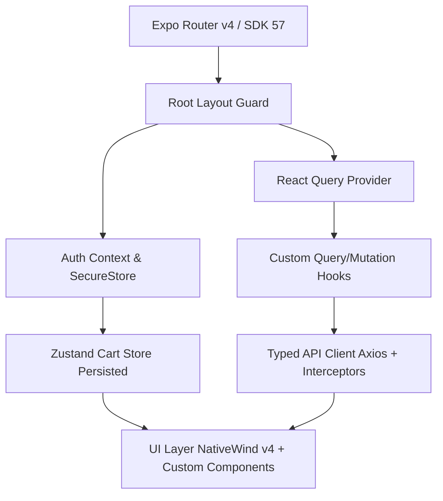

> **STATUS: ARCHIVED — PRE-REWRITE AUDIT**
>
> This documentation suite is a technical audit written against the legacy
> Dfood-app architecture (custom JWT-auth backend, Firebase, Paystack). The app
> is being rewritten on public APIs (Yelp Fusion + TheMealDB) with auth removed,
> so this is **not** a current roadmap. It is kept for reference only — the
> per-screen bug notes (nested ScrollView/FlatList virtualization, hardcoded
> `isRefreshing`, un-memoized bottom sheet snap points, missing skeleton
> loaders, etc.) may be worth revisiting once the new screens exist.

# Dfood App Improvement Blueprint: Eliminating Code Slop

> **Project Target:** Transform `Dfood-app` from a fragile, loosely-typed React Native application into an enterprise-ready, production-grade food delivery app using Expo SDK 57, React Native 0.86, React Query v5, Zustand, and NativeWind v4.

---

## 📌 Executive Summary

This documentation suite serves as the complete technical audit and architectural roadmap for rebuilding and upgrading the `Dfood-app` codebase. The existing implementation contains key areas of technical debt, unhandled edge cases, sub-optimal UI patterns, and routing vulnerabilities—referred to collectively as **"code slop"**.

This document outlines the high-level architecture, global principles, Expo best practices, and directory map for the comprehensive upgrade.

---

## 🗂 Documentation Structure

| Document | Section / Module | Key Focus Areas |
| :--- | :--- | :--- |
| [`01-onboarding.md`](./01-onboarding.md) | **Onboarding** | `Animated.FlatList` performance, shared values, step persistence, screen layout |
| [`02-auth.md`](./02-auth.md) | **Auth & Routing** | Route protection guards, `SecureStore` caching, OTP flow, Zod validation |
| [`03-home-categories.md`](./03-home-categories.md) | **Home & Categories** | ScrollView nesting fix, Skeleton loading, Pull-to-refresh, image caching |
| [`04-restaurants-food.md`](./04-restaurants-food.md) | **Restaurants & Food Details** | Dynamic routes, filter dialog memoization, add-on state, layout polish |
| [`05-cart-checkout.md`](./05-cart-checkout.md) | **Cart & Checkout** | Single-restaurant cart rules, `BottomSheet` rendering, Paystack integration, order creation |
| [`06-profile-settings.md`](./06-profile-settings.md) | **Profile, Address & Payment** | Avatar upload via FormData, location defaults, payment tokenization, profile mutations |
| [`07-orders.md`](./07-orders.md) | **Orders & Tracking** | Real-time WebSocket updates, `react-native-maps` performance, push notifications |
| [`08-infrastructure-best-practices.md`](./08-infrastructure-best-practices.md) | **Infrastructure & Quality** | Expo SDK 57 standards, React Query v5 cache rules, NativeWind v4 design system, Testing strategy |

---

## 🚨 Top 10 Codebase "Slop" Anti-Patterns Identified

1. **Fragile Navigation Guards (`app/_layout.tsx`)**
   - *Problem:* Using `hasNavigated.current` ref inside `useEffect` causes navigation state deadlocks, skipping route evaluation on auth changes or deep links.
   - *Fix:* Replace imperative ref checks with declarative Expo Router layout protection (`<Stack />` route guards, `Redirect`, or `useRootNavigationState`).

2. **Nested Virtualized Lists (`app/(app)/index.tsx`)**
   - *Problem:* Rendering `.map()` inside a `ScrollView` for restaurants disables list item virtualization, causing memory inflation and frame drops.
   - *Fix:* Convert to unified `FlatList` with header components or use `FlashList` for optimal 60fps rendering.

3. **Hardcoded Refresh Control State (`app/(app)/index.tsx`)**
   - *Problem:* `const isRefreshing = false;` hardcoded value disables active refreshing indicators during async query refetching.
   - *Fix:* Bind `isRefreshing` to React Query's `isRefetching` or `isFetching` status.

4. **Inconsistent Error Handling & Blind Alerts (`app/(auth)/signin.tsx`)**
   - *Problem:* Using generic `Alert.alert()` calls inline without central error mapping or UI feedback states.
   - *Fix:* Implement centralized error formatting, inline field errors, and Toast notifications.

5. **In-Memory Token Cache Race Conditions (`lib/api-client.ts`)**
   - *Problem:* Module-scoped `inMemoryToken` variable loses state across app reloads and doesn't handle token rotation cleanly.
   - *Fix:* Encapsulate token state inside `SecureStore` wrapper with automatic refresh token logic.

6. **Un-Memoized Bottom Sheets & Layout Shift (`app/(app)/checkout.tsx`)**
   - *Problem:* Re-creating `snapPoints` array and `BottomSheetBackdrop` on every render causes stutter during modal transitions.
   - *Fix:* Wrap snap points and renderBackdrop callbacks in `useMemo` / `useCallback` with static constants.

7. **Lack of Skeleton Loading Screens**
   - *Problem:* Full-screen blocking `ActivityIndicator` spinners create jarred layout jumps.
   - *Fix:* Introduce customized Skeleton loaders matching exact content shapes (`CategoryItem`, `RestaurantCard`).

8. **Missing Type Guard Assertions & `as any` Casts**
   - *Problem:* Loose types on API payloads and navigation params (`router.replace(targetRoute as any)`).
   - *Fix:* Enforce strict TypeScript types and Expo Router typed routes (`expo-router/build/typed-routes`).

9. **Unoptimized Images & Missing Caching**
   - *Problem:* Using raw remote image URLs without `expo-image` caching or content placeholder blurhashes.
   - *Fix:* Standardize all image renders with `expo-image`, providing memory/disk caching and fallback placeholders.

10. **Missing Test Coverage & CI/CD**
    - *Problem:* Zero unit tests for core domain logic (cart calculation, order total calculations, auth guards).
    - *Fix:* Introduce Jest, `@testing-library/react-native`, and GitHub Actions workflow for linting and build verification.

---

## 🛠 Target Architectural Pattern

---

## 🌟 Expo & React Native Official Best Practices Checklist

- [ ] **Expo Router (File-Based Navigation):** Use layout groups `(auth)` and `(app)` with typed routes and relative navigation.
- [ ] **Expo SecureStore:** Store sensitive tokens (JWT, refresh tokens) in `SecureStore` (Keychain / KeyStore).
- [ ] **Expo Image:** Replace `react-native` Image with `expo-image` for high-performance memory/disk caching and webp/avif support.
- [ ] **Expo Location & Notifications:** Handle permissions dynamically with fallback UI states.
- [ ] **NativeWind v4:** Utilize utility classes with dynamic design tokens configured in `tailwind.config.js`.
- [ ] **TanStack React Query v5:** Explicit `staleTime`, `gcTime`, query keys, and optimistic updates.
